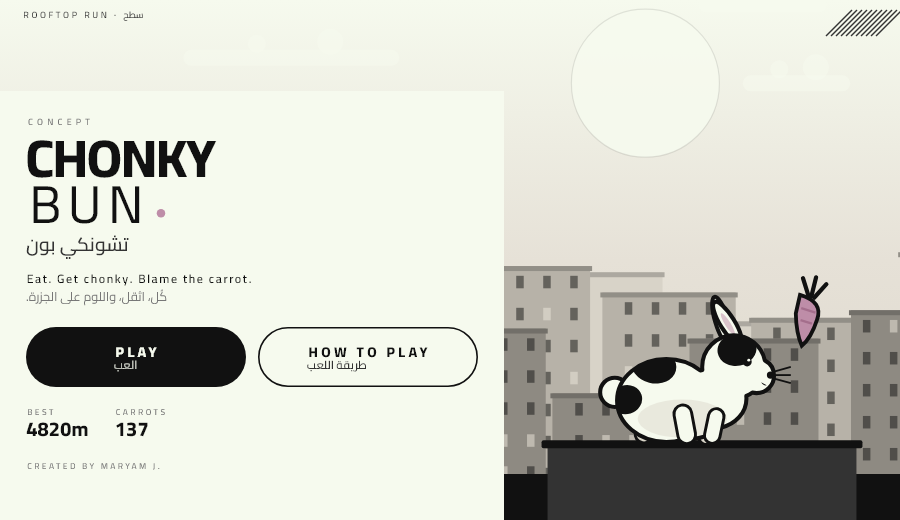

# Munchi Bun

A chubby rooftop runner. You are a rabbit who eats carrots. Carrots are heavy. Being
heavy makes you jump lower, and the gaps keep widening no matter how much you weigh -
so greed is what eventually stops you. The challenge is rhythm, and knowing when to
leave a carrot behind.

Bauhaus monochrome art, bilingual English + Arabic interface, and a single-button
control scheme. Runs as a native Android app (APK) and in any browser (Flutter Web).

Created by Maryam J.



## Controls

Hold to jump, release to cut the jump short. A tap just before landing triggers a jump
on the next frame. The rabbit can still jump for a few frames after walking off a roof
edge.

## Architecture

The simulation and the rendering are completely separate, which is what makes the game
testable and the feel tunable.

- `lib/game/sim.dart` - the entire game as deterministic pure Dart. It imports only
  `dart:math`. No Flutter types, no clock, no input. Every frame is `update(dt)`, so a
  run is reproducible from a seed and a physics regression is a unit test.
- `lib/game/painter.dart` - one `CustomPainter` that draws the world in a resolution
  independent unit space. Portrait and landscape share the same code path.
- `lib/screens/` - home, onboarding, and the in-game screen (HUD, pause, result card).
- `lib/core/l10n.dart` - bilingual strings rendered per line with the correct text
  direction.
- `lib/state/save.dart` - best score and career carrots, persisted with
  `shared_preferences`.

### Physics

Weight is a single scalar in `[0, 1]` that rises with every carrot. Jump velocity shrinks
with it:

```
jumpVel(w) = 1040 - 620w        gravity = 2500
```

The generator guarantees two things, and they are what make the game fair rather
than lucky. Every roof extends well past the landing point of a full jump taken
at the previous lip, so landing is never the part that beats you. And the step up
to the next roof is capped against how high a jump can lift.

What is deliberately *not* capped is the gap: gaps widen with distance travelled
and never shrink because the rabbit happens to be fat. That is the whole
punishment for eating - a lean rabbit clears everything the generator can produce,
and a greedy one eventually meets a gap its own weight can no longer reach. The
result card says "Too chubby to clear it" because that is genuinely what happened.

On top of that: coyote time, jump buffering, variable jump height, and a clamped
integration step so a stalled frame can never push the rabbit through a wall.

## Running it

```
flutter pub get
flutter run                 # attached device or -d chrome
```

The Arabic-capable font (Cairo) is bundled, because Flutter Web and CanvasKit do not
ship an Arabic fallback.

## Tests

```
flutter test                # 24 tests
flutter analyze
```

- `test/sim_test.dart` - 11 tests for physics and generator invariants.
- `test/render_test.dart` - 11 golden tests covering 12 screenshots across portrait and
  landscape, including the HUD and both overlays. Fonts are loaded explicitly in
  `setUpAll` because `flutter test` disables asset fonts by default.
- `test/icon_test.dart` - draws the launcher icon at every density using the game's own
  painters; runs only when `ICON_OUT=1` is set.
- `test/demo_capture_test.dart` - renders the demo film; inert unless `DEMO_OUT` is set.

To play without a screen, drive an auto-jumping bot through the simulation:

```
dart run tool/playtest.dart      # the naive player: how most runs actually end
dart run tool/botbench.dart 1500 # a player that solves each jump, over 1500 seeds
```

`lib/game/bot.dart` is that second player. It exists because the game is fully
deterministic: the same seed and the same 1/60 steps always produce the same run, so
a level worth filming can be found by sweeping seeds instead of playing them.

## Filming a demo

The clip is rendered, not screen-recorded, so it has no dropped frames and no
desktop in the background. The widget tree is pumped one 60th of a second at a time
and every frame is rasterised by the same Skia the app ships:

```
DEMO_OUT=build/demo flutter test test/demo_capture_test.dart
bash tool/make_video.sh build/demo 48 build/munchi-bun-demo.mp4
```

It is 1080x1920 H.264, so it posts straight to Reels, Shorts or TikTok.
`DEMO_FRAMES=60` renders a handful of frames for trying the pipeline.

## Building

```
flutter build apk --release --split-per-abi    # arm64 is the one most phones need
flutter build web --release
```

The web build takes three query parameters for direct entry: `?play=1` starts a run
immediately, `?guide=1` opens the onboarding, and `?demo=1` lets the autopilot play
itself as an attract mode. An attract-mode run is never written to your saved record.

## License notes

Cairo is bundled under the SIL Open Font License. Everything else in this repository is
original to the project.
